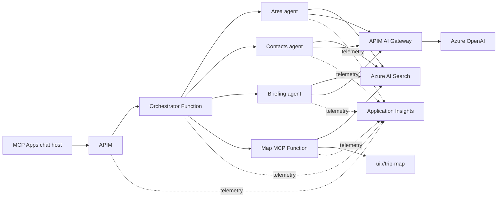

# Multi-Agent Azure Architecture

Multiple Azure Function-hosted agents use Azure AI Search for grounded retrieval and Azure OpenAI through an API Management AI Gateway. A single MCP server provides the Azure Maps MCP App, while Application Insights collects telemetry across the system.

## Build Week Lab Definition

### Lab Objective

Build and deploy an **Engagement Itinerary Planner** using multiple specialist agents hosted in Azure Functions. The agents use the repository's engagement data model, retrieve grounded records from Azure AI Search, and produce an itinerary rendered by one Azure Maps MCP App. Azure API Management provides the AI gateway, and Application Insights instruments every component.

### Use Cases

- **Request orchestration:** Route a natural-language planning request to the appropriate area, contacts, and briefing agents while tracking tool calls, status, timestamps, and outputs.
- **Area intelligence:** Find relevant regions, events, topics, approved messages, and available leaders for a requested location or event.
- **Candidate selection:** Identify authorized contacts and prospects using topic relevance, strategic value, relationship staleness, proximity, and caller preferences.
- **Itinerary construction:** Build ordered stops and travel legs, calculate trip ROI, flag conflicts, and return structured map data.
- **Grounded briefing:** Generate concise answers from retrieved engagement history and approved talking points without inventing records.

### Data Sources

- **Build-week sources:** Synthetic, pre-conformed `Region`, `Leader`, `Contact`, `Event`, `Topic`, `Message`, `Engagement`, and `AfterActionNote` records in [`engagement-intelligence/seed`](../engagement-intelligence/seed/README.md).
- **Runtime outputs:** `Trip`, `Stop`, and `Leg` records produced by the deterministic planner.
- **Future enterprise sources:** SharePoint lists, Outlook calendars, event directories, strategic-messaging libraries, and uploaded after-action PDFs.

### Ingestion Mechanism

All build-week stages run in the development environment with synthetic data. Records are normalized to the shared schema, labeled with `tenantId`, `aclGroups`, `sensitivity`, `source`, and timestamps, written as one JSON blob per record, and indexed by source into the shared `engagements` Azure AI Search index. Agents query the index through a common security-trimmed retrieval layer.

### Data Formats

- **Primary:** JSON domain records and MCP `structuredContent` responses.
- **Geospatial:** Pre-geocoded latitude/longitude stored on regions, contacts, events, stops, and legs.
- **Optional extension:** PDF after-action reports normalized into JSON with Azure Document Intelligence.

### Extraction and Enrichment

- No broad web crawling is required for the core lab.
- Source adapters normalize approved enterprise records into the canonical engagement schema.
- Azure AI Search provides keyword, semantic, and vector retrieval with mandatory tenant and ACL filters.
- Azure OpenAI embeddings can be generated during indexing; deterministic code owns distance, ranking, routing, conflicts, and ROI.

### Consumption

- **Azure OpenAI through APIM AI Gateway:** Agent reasoning and tool selection, with managed identity, token limits, quotas, and token metrics.
- **Azure AI Search:** Security-trimmed indexing and grounded hybrid retrieval for every specialist agent.
- **Azure Functions:** Orchestrator, area, contacts, and briefing agents, plus the stateless MCP endpoint.
- **MCP Apps client and Azure Maps:** One `ui://trip-map` resource renders the authorized itinerary; text remains available as a non-UI fallback.
- **Blob Storage and Durable Functions storage:** Source artifacts, generated trips, and orchestration state. Cosmos DB is not required for the core lab.
- **Application Insights and Azure Monitor:** Distributed traces across APIM, agents, MCP calls, Search, and Azure OpenAI; request latency, failures, tool usage, token usage, Search duration, result counts, and redaction counts. Prompt bodies, retrieved records, and credentials are not logged by default.

## Five-Day Build Plan

Day 0 is a readiness gate before the five build days. The suggested ownership model is:

- **Team 1:** Data ingestion, Azure AI Search, and grounded retrieval.
- **Team 2:** Specialist agents, orchestration, and deterministic planning.
- **Team 3:** MCP App, Azure Maps, platform integration, and observability.

| Gate  | Owner     | Workstream          | Activity                          | Outcome / Exit Criteria                                                                                                                                    |
| ----- | --------- | ------------------- | --------------------------------- | ---------------------------------------------------------------------------------------------------------------------------------------------------------- |
| Day 0 | All teams | Scope               | Outcome and demo scenarios        | Agree on the target architecture, success criteria, representative planning request, and four stretch scenarios.                                           |
| Day 0 | All teams | Environment         | Azure access and prerequisites    | Confirm access to Azure Functions, Azure AI Search, Azure OpenAI, APIM, Azure Maps, Blob Storage, Application Insights, Key Vault, and the repositories.   |
| Day 0 | All teams | Architecture        | Contracts and security model      | Confirm shared schemas, MCP contracts, agent responsibilities, `tenantId`, `aclGroups`, sensitivity, provenance, and trace-context requirements.           |
| Day 0 | All teams | Delivery            | Ownership and integration cadence | Assign workstream owners, integration handoffs, branching strategy, daily checkpoints, and demo responsibilities.                                          |
| Day 1 | Team 1    | Data foundation     | Normalize synthetic records       | Validate Region, Leader, Contact, Event, Topic, Message, Engagement, and AfterActionNote records against the shared schema.                                |
| Day 1 | Team 1    | Storage             | Blob ingestion layout             | Write one JSON blob per normalized record with source, timestamp, tenant, ACL, and sensitivity metadata.                                                   |
| Day 1 | Team 1    | Search              | Azure AI Search index             | Create the shared engagements index and ingest the initial synthetic dataset with filterable security fields.                                              |
| Day 1 | Team 2    | Agent runtime       | Azure Functions foundation        | Create Function entry points for the orchestrator, area, contacts, and briefing agents with shared request and response contracts.                         |
| Day 1 | Team 2    | Planning            | Deterministic planner integration | Expose candidate scoring, routing, ROI, conflicts, stops, and legs as reusable agent tools.                                                                |
| Day 1 | Team 3    | Experience          | MCP and map baseline              | Run the stateless MCP endpoint and render a sample structured itinerary through the `ui://trip-map` Azure Maps App.                                        |
| Day 1 | Team 3    | Platform            | Infrastructure baseline           | Establish deployment configuration, managed identities, Key Vault references, and environment settings.                                                    |
| Day 1 | All teams | Gate                | Local thin slice                  | A synthetic request produces a valid Trip, Stop, and Leg payload and renders on the map locally.                                                           |
| Day 2 | Team 1    | Retrieval           | Security-trimmed search layer     | Implement common retrieval with tenant and ACL filtering, sensitivity enforcement, result counts, and provenance.                                          |
| Day 2 | Team 1    | Search              | Grounded hybrid retrieval         | Add keyword, vector, and semantic retrieval for regions, events, topics, messages, engagements, and after-action notes.                                    |
| Day 2 | Team 2    | Area intelligence   | Area specialist                   | Retrieve relevant regions, events, topics, approved messages, and available leaders for a location or event.                                               |
| Day 2 | Team 2    | Candidate selection | Contacts specialist               | Rank authorized contacts using relevance, strategic value, staleness, proximity, availability, and caller preferences.                                     |
| Day 2 | Team 2    | Grounded briefing   | Briefing specialist               | Generate concise briefings from retrieved engagement history and approved talking points, with source references and no invented records.                  |
| Day 2 | Team 3    | AI gateway          | APIM and Azure OpenAI             | Route model calls through APIM using managed identity; configure token limits, quotas, retries, and token metrics.                                         |
| Day 2 | All teams | Gate                | Grounded agent slice              | One request runs through Search and all specialist agents, returning security-trimmed candidates and a sourced briefing.                                   |
| Day 3 | Team 2    | Orchestration       | Multi-agent workflow              | Route requests to the correct specialists and track agent status, tool calls, timestamps, outputs, retries, and failures.                                  |
| Day 3 | Team 2    | Itinerary           | Trip construction                 | Build ordered stops and travel legs, calculate ROI, flag conflicts, and return authorized structured map data.                                             |
| Day 3 | Team 3    | Web experience      | Request initiation and tracking   | Add a UI for submitting natural-language planning requests and viewing orchestration progress.                                                             |
| Day 3 | Team 3    | MCP App             | Azure Maps integration            | Render stops, routes, candidate details, ROI, and warnings while retaining a complete text fallback.                                                       |
| Day 3 | All teams | Integration         | End-to-end deployment             | Deploy the first complete flow across Functions, Search, APIM, Azure OpenAI, MCP, and Azure Maps.                                                          |
| Day 3 | All teams | Gate                | Foundational demo                 | A user submits a request and receives a grounded, authorized itinerary rendered on the map.                                                                |
| Day 4 | All teams | Observability       | Distributed telemetry             | Correlate traces across APIM, Functions, agents, MCP tools, Search, Azure OpenAI, and the web client.                                                      |
| Day 4 | Team 3    | Dashboard           | Operational visibility            | Display orchestration progress, latency, failures, tool usage, token usage, Search duration, result counts, and redaction counts.                          |
| Day 4 | All teams | Security            | Security validation               | Verify managed identity, Key Vault integration, tenant isolation, ACL trimming, sensitivity handling, and telemetry redaction.                             |
| Day 4 | All teams | Testing             | Scenario validation               | Test at least four scenarios across different locations, events, caller personas, preferences, and authorization boundaries.                               |
| Day 4 | All teams | Stabilization       | Reliability and performance       | Fix integration defects; tune retries, timeouts, Search performance, Function latency, and prompt/token use.                                               |
| Day 4 | All teams | Gate                | Release candidate                 | Four reviewable scenarios pass functional, security, observability, and fallback checks.                                                                   |
| Day 5 | Team 3    | Guided replanning   | Revise and rerun                  | Allow users to submit new guidance and regenerate the full itinerary or selected stops while preserving run history.                                       |
| Day 5 | Team 1    | Stretch ingestion   | Public web pipeline               | Search, scrape, extract, classify, and ingest approved public pages with provenance captured.                                                              |
| Day 5 | Team 1    | Stretch documents   | PDF grounding                     | Normalize approved after-action PDFs with Document Intelligence and expose them through security-trimmed retrieval.                                        |
| Day 5 | All teams | Readiness           | Documentation and handoff         | Finalize architecture, deployment steps, runbooks, security decisions, known issues, and the prioritized backlog.                                          |
| Day 5 | All teams | Closure             | Final demonstration               | Demonstrate request tracking, multi-agent orchestration, grounded retrieval, itinerary generation, Azure Maps rendering, telemetry, and guided replanning. |

